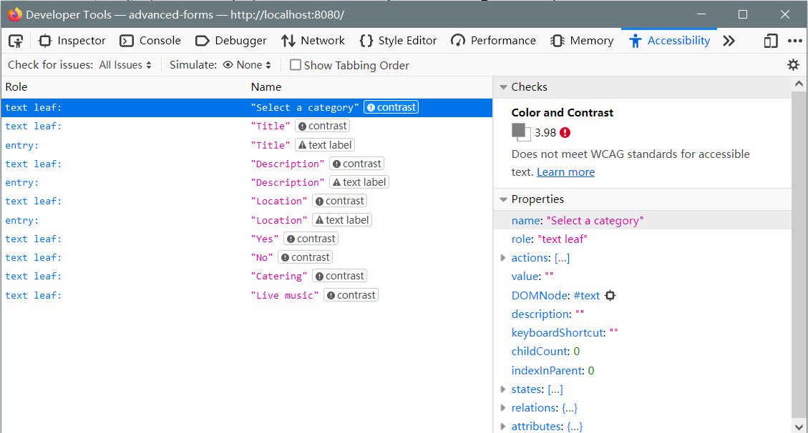

# Vue 3 Forms
https://www.vuemastery.com/courses/vue3-forms/
https://www.vuemastery.com/courses/validating-vue3-forms/

## Vue 3 Forms

### **[v-model](https://v3.vuejs.org/guide/component-custom-events.html#v-model-arguments)**

```vue
<input
  :value="modelValue"
  :placeholder="label"
  @input="$emit('update:modelValue', $event.target.value)"
  class="field"
>
```

### **[$attrs](https://v3.vuejs.org/api/instance-properties.html#attrs)**

```vue
<input
  v-bind="$attrs"
  :value="modelValue"
  :placeholder="label"
  @input="$emit('update:modelValue', $event.target.value)"
  class="field"
>
```

```vue
<input
  :value="modelValue"
  :placeholder="label"
  v-bind="{
     ...$attrs,
     onInput:($event) => { $emit('update:modelValue', $event.target.value) } 
  }"
  class="field"
>
```

### **accessibility (a11y)**

 

*fieldset*

The ```fieldset``` HTML element is used to group several controls as well as labels (```label```) within a web form.

*legend*

The ```legend``` HTML element represents a caption for the content of its parent ```fieldset```.

*ARIA*

1. [ARIA in HTML](https://www.w3.org/TR/html-aria/)

2. [Introduction to ARIA](https://developers.google.com/web/fundamentals/accessibility/semantics-aria/)
3. [ARIA HTML Tutorial - What is ARIA & Why it's Important to Use!](https://youtu.be/0hqhAIjE_8I)


## Validating Vue 3 Forms

